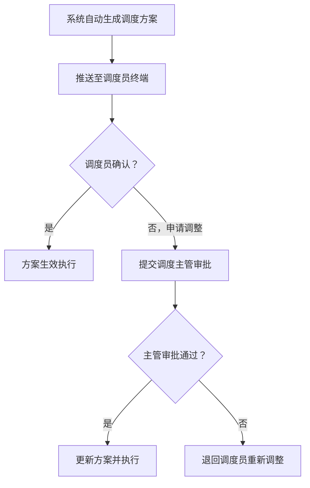
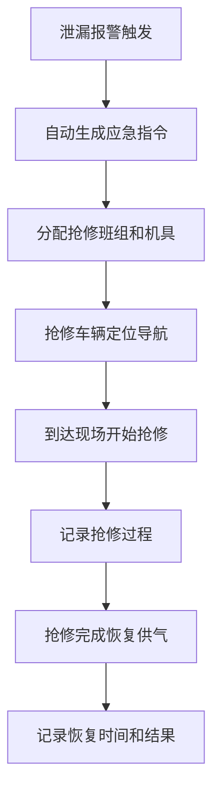
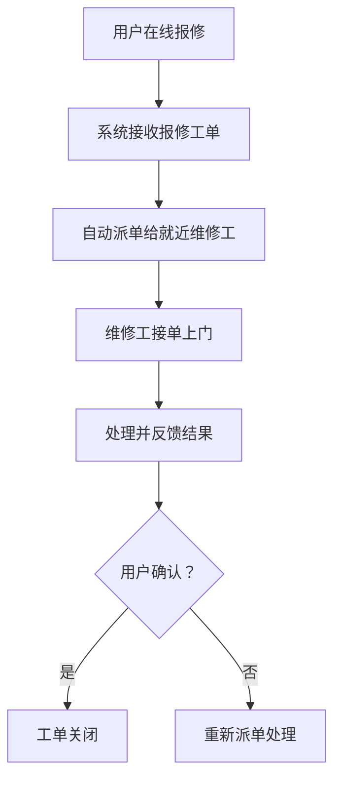

## 1. 产品概述

城市燃气输配智能调度与应急抢修管理桌面系统，面向城市燃气运营企业，实现从气源调度、管网监控到应急抢修的全流程数字化管理。

- 解决燃气调度依赖人工经验、应急响应滞后、运营数据分散等痛点
- 为燃气调度员、抢修人员、运营管理者提供一体化智能管理平台
- 目标价值：提升供气安全性、降低管网漏损率、缩短应急响应时间

## 2. 核心功能

### 2.1 用户角色

| 角色 | 核心权限 |
|------|----------|
| 系统管理员 | 用户管理、基础数据配置、系统设置 |
| 调度主管 | 审批调度方案、查看全局运营数据、管理调度规则 |
| 调度员 | 查看/确认调度方案、申请调整方案、监控管网实时状态 |
| 抢修班组 | 接收抢修指令、反馈抢修进度、查看抢修历史 |
| 维修人员 | 接收用户报修工单、上门维修、反馈处理结果 |
| 运营管理者 | 查看统计报表、导出月度分析报告 |

### 2.2 功能模块

1. **数据看板**：全局运营概览、关键指标卡片、管网状态总览
2. **基础信息管理**：气源门站管理、管网节点管理、用户信息管理
3. **智能调度中心**：调度方案生成、方案审批、方案推送、调度历史
4. **管网实时监控**：压力热力图、节点状态监控、异常告警处理
5. **应急抢修管理**：泄漏报警、抢修派单、抢修过程记录、抢修车辆定位
6. **用户报修服务**：在线报修、工单派发、维修进度跟踪
7. **统计分析报表**：多维度数据统计、月度运营分析报告、PDF导出
8. **系统设置**：用户管理、角色权限、规则配置

### 2.3 页面详情

| 页面名称 | 模块名称 | 功能描述 |
|----------|----------|----------|
| 数据看板 | 指标概览 | 展示日供气量、压力合格率、抢修及时率、气损率等KPI |
| 数据看板 | 管网地图 | 可视化管网地图，实时显示各节点压力热力和抢修车辆位置 |
| 数据看板 | 告警列表 | 显示当前未处理的压力异常和泄漏告警 |
| 门站管理 | 门站列表 | 气源门站信息录入、编辑、删除、查询 |
| 门站管理 | 门站详情 | 展示门站位置、供气能力、气质参数详情 |
| 管网节点管理 | 节点列表 | 调压站/阀门/管径/设计压力等信息管理 |
| 用户信息管理 | 用户列表 | 工业/商业/居民用户信息及用气量管理 |
| 调度方案 | 方案生成 | 根据历史数据、天气、节假日自动生成每日供气调度方案 |
| 调度方案 | 方案审批 | 调度员确认或申请调整，主管审批调整申请 |
| 调度方案 | 方案推送 | 已确认方案推送至调度员终端 |
| 管网监控 | 状态监控 | 实时更新管网状态（正常/压力偏低/泄漏/抢修） |
| 管网监控 | 异常处理 | 压力异常自动触发调压站切换并通知巡检人员 |
| 应急抢修 | 报警处理 | 泄漏报警自动生成应急指令，分配抢修班组和机具 |
| 应急抢修 | 过程记录 | 记录抢修过程、恢复时间、处置结果 |
| 用户报修 | 报修列表 | 在线报修工单接收与管理 |
| 用户报修 | 工单派发 | 自动派单给维修工，跟踪维修进度 |
| 统计报表 | 数据统计 | 按区域/用户类型/时间段统计供气量、压力合格率等 |
| 统计报表 | 报告导出 | 导出PDF格式月度运营分析报告 |
| 系统设置 | 用户管理 | 用户账号、角色、权限配置 |

## 3. 核心流程

### 3.1 日常调度流程

调度系统每日自动根据历史用气数据、天气预报和节假日因素生成供气调度方案，调度员确认后推送至各终端，如需调整则提交主管审批。

### 3.2 应急抢修流程

管网泄漏报警触发后，系统自动分配抢修资源，抢修班组接单处置，完成后恢复供气并记录。

### 3.3 用户报修流程

用户在线报修后系统自动派单，维修工上门处理，反馈结果并关闭工单。

## 4. 用户界面设计

### 4.1 设计风格

- **主色调**：深海军蓝 (#0A2540) 作为主色，体现工业系统的专业稳重感
- **辅助色**：警示橙 (#FF6B35) 用于告警，安全绿 (#36B37E) 用于正常状态，紧急红 (#E5484D) 用于泄漏报警
- **中性色**：深灰 (#1A202C) 背景、浅灰 (#F7FAFC) 面板、白色 (#FFFFFF) 卡片
- **按钮风格**：直角微圆角(4px)、扁平化设计、状态变化有明确的颜色反馈
- **字体**：标题使用思源黑体 Bold，正文使用思源黑体 Regular，数据展示使用等宽字体 JetBrains Mono
- **布局风格**：顶部导航 + 左侧菜单 + 右侧内容区的经典管理后台布局，卡片式内容组织
- **图标风格**：使用 Lucide 线性图标，保持简洁专业

### 4.2 页面设计概览

| 页面名称 | 模块名称 | UI元素 |
|----------|----------|--------|
| 数据看板 | 指标概览 | 深色背景，渐变指标卡片，数字动画，状态指示灯 |
| 数据看板 | 管网地图 | 全屏SVG地图，压力热力渐变，节点动态闪烁，车辆位置标记 |
| 数据看板 | 告警列表 | 时间线式告警列表，不同级别告警颜色区分 |
| 列表管理页 | 通用 | 顶部筛选区，数据表格，操作按钮，分页器 |
| 表单录入页 | 通用 | 分区表单，分组标签，必填标记，实时校验 |
| 调度方案页 | 方案详情 | 时间轴式方案展示，审批流状态，操作按钮组 |
| 管网监控页 | 实时监控 | 大屏数据面板，实时曲线图，状态指示灯动画 |
| 抢修管理页 | 工单详情 | 地图定位 + 工单信息双栏布局，进度时间轴 |
| 统计报表页 | 图表 | ECharts图表（柱状图、折线图、饼图），数据透视，导出按钮 |

### 4.3 响应式设计

- 桌面端优先设计，目标分辨率 1920×1080
- 最小支持分辨率 1366×768，横向滚动处理超宽表格
- 侧边栏可折叠，内容区自适应

### 4.4 动效设计

- 页面加载：内容区渐入动画
- 告警弹出：从右侧滑入 + 轻微震动效果
- 状态变化：颜色渐变过渡（300ms）
- 数据刷新：数字滚动动画
- 管网节点闪烁：异常节点呼吸灯效果
