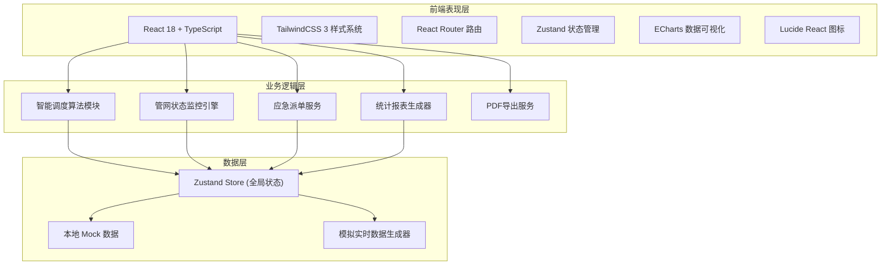
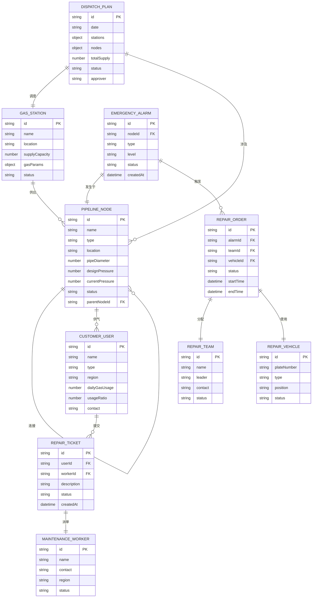

## 1. 架构设计



## 2. 技术选型说明

- **前端框架**: React@18 + TypeScript
- **初始化工具**: vite-init
- **后端**: 无后端，纯前端 Mock 数据模拟
- **数据存储**: Zustand 状态管理 + 本地 JSON Mock 数据
- **样式方案**: TailwindCSS 3
- **路由管理**: React Router DOM
- **状态管理**: Zustand
- **图表可视化**: ECharts
- **图标库**: Lucide React
- **PDF导出**: jsPDF + html2canvas

## 3. 路由定义

| 路由 | 页面 | 功能说明 |
|------|------|----------|
| /dashboard | 数据看板 | 全局运营概览、管网地图、告警列表 |
| /stations | 门站管理 | 气源门站信息CRUD |
| /nodes | 管网节点管理 | 调压站、阀门、管网节点管理 |
| /users | 用户信息管理 | 工业/商业/居民用户管理 |
| /dispatch | 调度方案中心 | 调度方案生成、审批、推送 |
| /monitor | 管网实时监控 | 压力监控、异常处理、调压切换 |
| /emergency | 应急抢修管理 | 泄漏报警、抢修派单、过程记录 |
| /repair | 用户报修服务 | 报修工单、维修派单、进度跟踪 |
| /reports | 统计分析报表 | 多维度统计、PDF报告导出 |
| /settings | 系统设置 | 用户管理、权限配置 |

## 4. 数据模型

### 4.1 实体关系图



### 4.2 核心数据结构

#### 气源门站 (GasStation)
```typescript
interface GasStation {
  id: string;
  name: string;
  address: string;
  longitude: number;
  latitude: number;
  supplyCapacity: number; // 万立方米/日
  currentOutput: number;
  gasQuality: {
    methane: number; // %
    calorificValue: number; // MJ/m³
    sulfurContent: number; // mg/m³
    pressure: number; // MPa
  };
  status: 'normal' | 'maintenance' | 'offline';
  operator: string;
  lastInspection: string;
}
```

#### 管网节点 (PipelineNode)
```typescript
interface PipelineNode {
  id: string;
  name: string;
  type: 'regulator' | 'valve' | 'junction';
  address: string;
  longitude: number;
  latitude: number;
  pipeDiameter: number; // mm
  designPressure: number; // MPa
  currentPressure: number; // MPa
  minPressure: number;
  maxPressure: number;
  connectedNodes: string[];
  status: 'normal' | 'low_pressure' | 'high_pressure' | 'leak' | 'repair' | 'offline';
  lastUpdate: string;
}
```

#### 用户信息 (Customer)
```typescript
interface Customer {
  id: string;
  name: string;
  type: 'industrial' | 'commercial' | 'residential';
  region: string;
  address: string;
  dailyGasUsage: number; // m³/日
  monthlyUsage: number[];
  usageRatio: number; // 占比
  contact: string;
  phone: string;
  registerDate: string;
  status: 'active' | 'suspended';
}
```

#### 调度方案 (DispatchPlan)
```typescript
interface DispatchPlan {
  id: string;
  planDate: string;
  generatedAt: string;
  generatedBy: 'system' | 'manual';
  weather: {
    temperature: number;
    condition: string;
    humidity: number;
  };
  isHoliday: boolean;
  holidayName?: string;
  stations: Array<{
    stationId: string;
    stationName: string;
    plannedOutput: number;
  }>;
  nodes: Array<{
    nodeId: string;
    nodeName: string;
    targetPressure: number;
  }>;
  storageUsage: number; // 储气库调用量
  totalDailySupply: number;
  pressureBalanceScore: number; // 压力平衡评分
  status: 'draft' | 'pending' | 'confirmed' | 'adjust_requested' | 'approved' | 'rejected';
  dispatcherId?: string;
  dispatcherName?: string;
  supervisorId?: string;
  supervisorName?: string;
  adjustReason?: string;
  pushStatus: 'not_pushed' | 'pushed';
}
```

#### 应急告警 (EmergencyAlarm)
```typescript
interface EmergencyAlarm {
  id: string;
  nodeId: string;
  nodeName: string;
  type: 'pressure_low' | 'pressure_high' | 'leak' | 'equipment_fault';
  level: 'critical' | 'warning' | 'info';
  description: string;
  status: 'pending' | 'processing' | 'resolved' | 'false_alarm';
  createdAt: string;
  confirmedAt?: string;
  resolvedAt?: string;
  handlerId?: string;
  handlerName?: string;
}
```

#### 抢修工单 (RepairOrder)
```typescript
interface RepairOrder {
  id: string;
  alarmId: string;
  nodeId: string;
  nodeName: string;
  teamId: string;
  teamName: string;
  vehicleId: string;
  vehiclePlate: string;
  equipment: string[];
  status: 'assigned' | 'en_route' | 'on_site' | 'repairing' | 'completed' | 'cancelled';
  assignedAt: string;
  arrivedAt?: string;
  startedAt?: string;
  completedAt?: string;
  repairDuration?: number; // 分钟
  description: string;
  repairNotes?: string;
  recoveryTime?: string;
}
```

## 5. 项目目录结构

```
src/
├── components/          # 公共组件
│   ├── layout/         # 布局组件
│   ├── charts/         # 图表组件
│   ├── map/            # 管网地图组件
│   ├── tables/         # 表格组件
│   ├── forms/          # 表单组件
│   └── ui/             # UI基础组件
├── pages/              # 页面组件
│   ├── Dashboard/
│   ├── Stations/
│   ├── Nodes/
│   ├── Users/
│   ├── Dispatch/
│   ├── Monitor/
│   ├── Emergency/
│   ├── Repair/
│   ├── Reports/
│   └── Settings/
├── store/              # Zustand 状态管理
│   ├── useStationStore.ts
│   ├── useNodeStore.ts
│   ├── useUserStore.ts
│   ├── useDispatchStore.ts
│   ├── useAlarmStore.ts
│   ├── useRepairStore.ts
│   └── useAuthStore.ts
├── data/               # Mock 数据
│   ├── stations.ts
│   ├── nodes.ts
│   ├── users.ts
│   ├── dispatch.ts
│   ├── alarms.ts
│   └── repairs.ts
├── utils/              # 工具函数
│   ├── dispatch.ts     # 调度算法
│   ├── statistics.ts   # 统计计算
│   ├── pdfExport.ts    # PDF导出
│   └── format.ts       # 格式化
├── types/              # TypeScript 类型定义
│   └── index.ts
├── App.tsx
├── main.tsx
└── index.css
```
